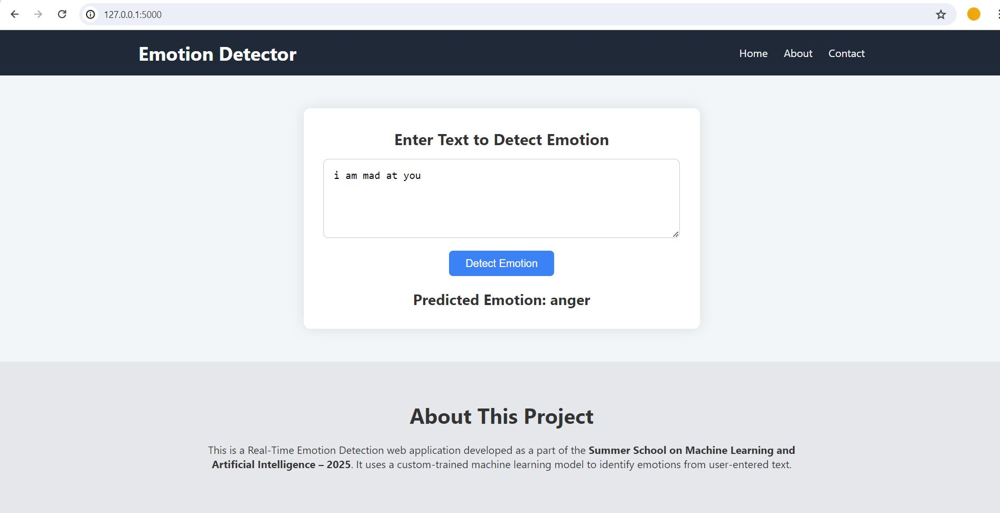

# Real-Time Emotion Detection from Text 💬🧠

A web application that identifies human emotions (like joy, sadness, anger, etc.) from user-entered text using a custom-trained Machine Learning model. Developed as part of the **Summer School on Machine Learning and Artificial Intelligence – 2025**.

---

## 🔍 Features

- Real-time text input for emotion classification  
- Six emotion categories: `joy`, `sadness`, `anger`, `fear`, `love`, `surprise`  
- Trained using Logistic Regression on a TF-IDF vectorized dataset  
- Clean and responsive frontend UI using **HTML**, **CSS**, and **JavaScript**  
- Lightweight **Flask** backend serving the model predictions  
- Entirely based on a flat file structure (no folders)

---

  

## 🛠️ Technologies Used

| Layer        | Tools / Technologies                            |
|--------------|--------------------------------------------------|
| Frontend     | HTML5, CSS3, JavaScript                         |
| Backend      | Python, Flask                                   |
| Machine Learning | Scikit-learn, TfidfVectorizer, Logistic Regression |
| Data Handling | Pandas, NumPy                                  |
| Visualization | Matplotlib, Seaborn (for analysis, not in UI) |
| Environment  | Google Colab (for training), VS Code (for app)  |

---

## 🧠 Model Details

- **Dataset**: [Emotions Dataset for NLP by Praveen Govi (Kaggle)](https://www.kaggle.com/datasets/praveengovi/emotions-dataset-for-nlp)
- **Text Vectorization**: TF-IDF with 5000 max features  
- **Model**: Logistic Regression  
- **Evaluation**: Trained and tested using `train.txt` and `val.txt` merged; achieved high accuracy on emotion classification  

---

